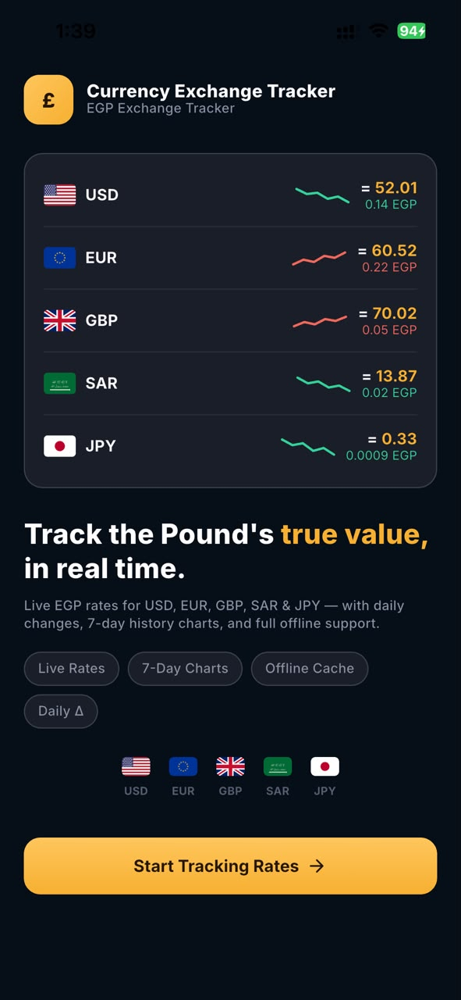
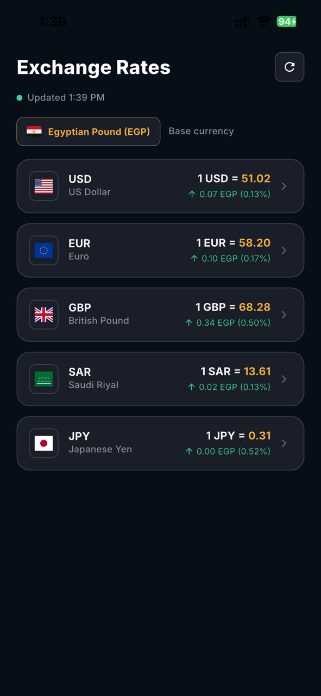
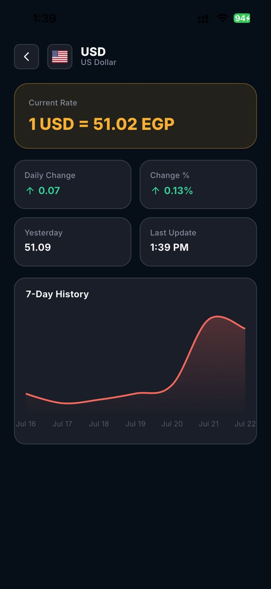
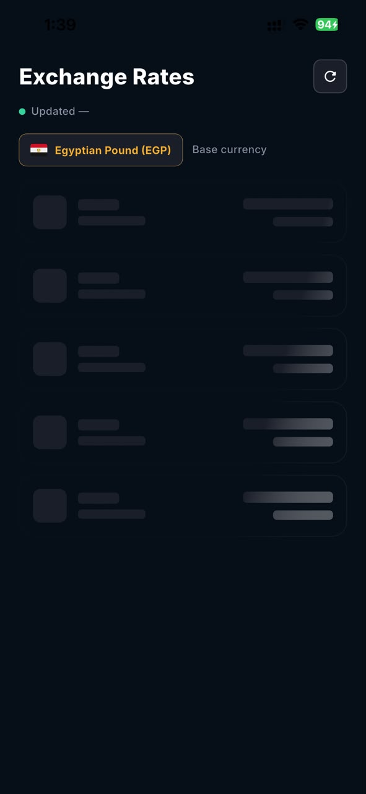

# Currency Exchange

A Flutter app that tracks live exchange rates for five major currencies against the
Egyptian Pound (EGP), with a detailed per-currency view, a 7-day historical price chart,
and full offline support.

> Base currency: **EGP** — Target currencies: **USD, EUR, GBP, SAR, JPY**

---

## Screenshots

| Onboarding | Exchange Rates | Currency Detail | Loading |
|:---:|:---:|:---:|:---:|
|  |  |  |  |

---

## Features

- **Live exchange rates** — Displays USD, EUR, GBP, SAR, and JPY against EGP in the
  `1 unit = X EGP` format, fetching all five rates in a single API call.
- **Daily change** — Fetches today's and yesterday's rates to compute the daily change as
  both an absolute value and a percentage, color-coded **green** when the EGP strengthens
  and **red** when it weakens, with a directional trend arrow.
- **Currency detail & 7-day chart** — Tapping a currency opens a detail screen showing the
  current rate, daily change, yesterday's rate, and the date of the last update, plus a
  `fl_chart` line chart of the last 7 days (7 historical calls, one per day).
- **Shimmer loading** — The rates list and history chart use skeleton shimmer placeholders
  (never spinners) while data is being fetched.
- **Offline caching** — The last fetched rates and history are persisted locally with Hive.
  When the device goes offline, cached data is served with a clear "last updated" indicator,
  and the app **auto-refreshes** as soon as connectivity returns.
- **Pull-to-refresh** — Manually re-fetch all rates with a pull gesture.
- **Full state handling** — Dedicated loading, error, and empty states across both screens.
- **Onboarding** — A one-time branded intro screen (persisted via an `onboarding_seen` flag).

---

## Architecture

The app follows **Clean Architecture** with a **feature-first** folder layout. Each feature
is split into three layers with a strict inward dependency direction
(`presentation → domain → data`):

- **`data`** — API data sources, Hive-backed local data sources, response models, and the
  repository implementation. All error handling and cache read-through / write-through logic
  lives here.
- **`domain`** — Framework-agnostic entities, value objects (e.g. `CurrencyRateChange`, which
  owns the rate-inversion and trend math), repository contracts, and use cases.
- **`presentation`** — `flutter_bloc` blocs, view models, pages, and widgets.

**State management** is domain-driven BLoC — one bloc per feature, each subscribing to a
shared `ConnectivityService`. Errors flow through the layers as `dartz` `Either<Failure, T>`
rather than thrown exceptions, and are categorized into user-facing messages by a central
`ErrorHandler`. The offline cache is inserted at the **repository** level, so both the list
and the detail chart get offline support transparently through the shared use case.

Dependency injection is handled with `get_it` + `injectable`.

---

## Tech Stack & Libraries

| Area | Package | Purpose |
|---|---|---|
| **State management** | `flutter_bloc`, `equatable` | Domain-driven BLoC + value equality |
| **DI** | `get_it`, `injectable` | Service locator + code-gen registration |
| **Functional error handling** | `dartz` | `Either<Failure, T>` result types |
| **Networking** | `dio`, `pretty_dio_logger` | HTTP client + request logging |
| **Local storage** | `hive`, `hive_flutter`, `shared_preferences` | Offline cache + settings |
| **Connectivity** | `connectivity_plus` | Online/offline detection & auto-refresh |
| **Charts** | `fl_chart` | 7-day historical line chart |
| **UI** | `flutter_screenutil`, `flutter_svg`, `shimmer`, `lottie` | Responsive sizing, flags, skeletons, animations |
| **Testing** | `bloc_test`, `mocktail` | Bloc state-transition + unit/widget tests |

---

## Project Structure

```
lib/
├── core/
│   ├── enums/               # Shared BlocStatus enum
│   ├── routing/             # App router, route names, navigation service
│   ├── services/
│   │   ├── connectivity/    # ConnectivityService (connectivity_plus)
│   │   ├── error/           # Failure model + ErrorHandler
│   │   ├── local/           # Bloc observer
│   │   ├── network/         # Dio client, interceptors, NetworkHelper
│   │   └── service_locator/ # get_it / injectable setup
│   ├── storage/             # HiveStorage box management
│   ├── theme/               # AppColors, AppTextStyle
│   └── utils/               # Endpoints, common functions, asset paths
│
└── features/
    ├── _shared/             # Cross-feature widgets (MiniSparkline)
    │
    ├── onBoarding/
    │   └── presentation/    # Onboarding page + widgets
    │
    ├── exchange_rates/
    │   ├── data/            # Remote/local data sources, model, repository impl
    │   ├── domain/          # Entities, CurrencyRateChange, repository, use case
    │   └── presentation/    # Bloc, view model, page, widgets
    │
    └── currency_detail/
        ├── data/            # History local data source
        ├── domain/          # CurrencyHistoryPoint entity
        └── presentation/    # Bloc, args, page, chart + stat widgets

test/                        # Unit, bloc, and widget tests (mocktail + bloc_test)
```

---


